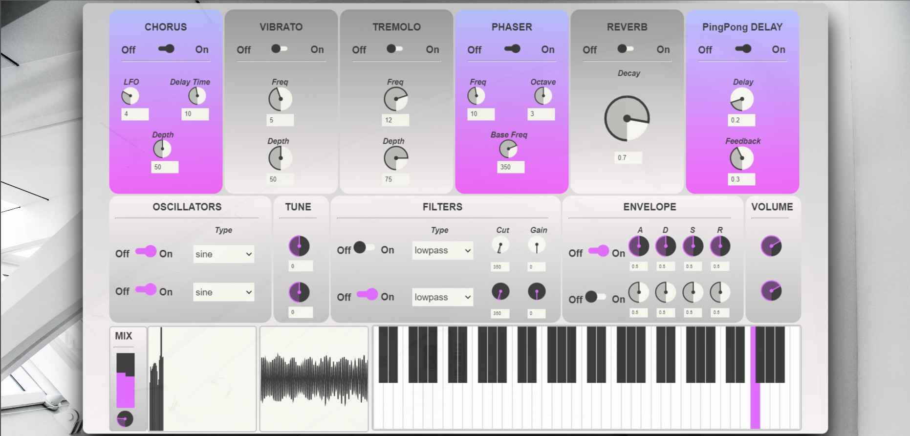

# ACTAM-Synth
The SYNTH is a polyphonic subtractive synthesizer with a chain of effects.
It offers many different controls to create many different sounds. 

To get started just open the index.html file in your browser.
The application was developed using Javascript and ToneJS APIs are at its core.

## How to use
There are 3 different ways of playing the synth: 
* Through the keyboard present in the GUI 
* Using a MIDI keyboard connected to your device
* Using the keyboard of your computer, following the mapping shown in the picture just below.

## Features
### Effects
The user has been given a chance to apply various effects to the sound. 
Effects that were chosen to be implemented in the project are: 
* Chorus
* Vibrato 
* Tremolo 
* Phaser
* Reverb
* Ping-pong delay
### Synthesizer
The synthesizer is composed of two independent channels. For each one there is:
* An oscillator section, in which you can choose to engage that particular oscillator, select the waveshape and its detuning factor;
* A filter section, in which you can choose to engage the filter for that particular channel, the type of filter (LPF, HPF, BP), the cut-off frequency and the gain;
* An amp section, in which you can set the ADSR envelope, the volume of each channel and also the output volume in the mix section.

Next to the keyboard there are two components: a Spectrogram and an Oscilloscope.

## Video demo and Report

A video demonstration of the *SYNTH* is available at this [link](https://www.youtube.com/watch?v=WsAfpsNt_E8&ab_channel=LorenzoConcina).
A brief pdf report of the *SYNTH* is available at this [link](https://github.com/fmiotello/actam_cmrm_project/blob/master/ACTAM_CMRM.pdf).

###

This application was developed as a project for "Advanced Coding Tools and Methodologies" course at [Politecnico di Milano](https://www.polimi.it) (MSc in Music and Acoustic Engineering).
